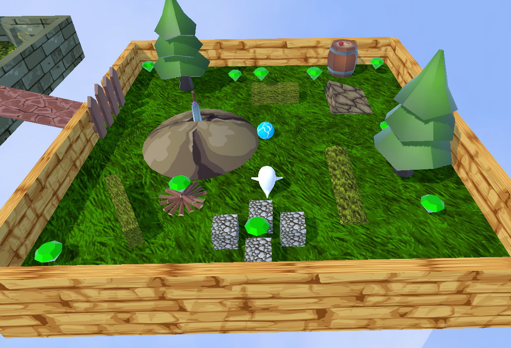
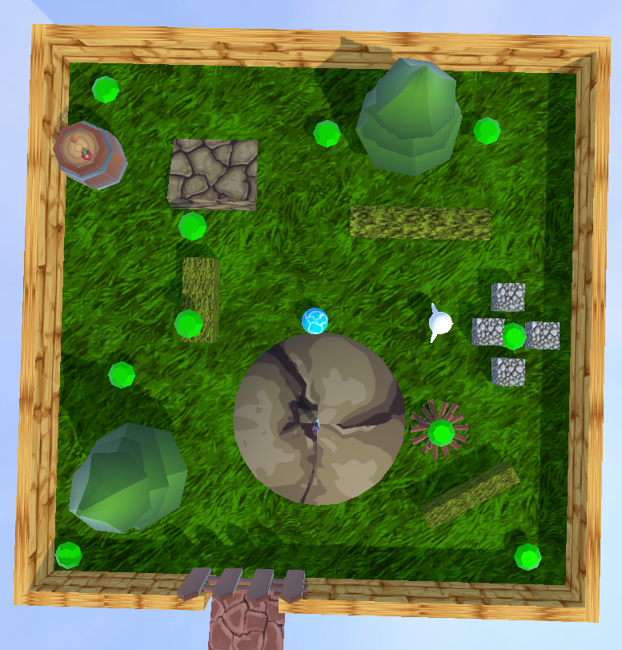
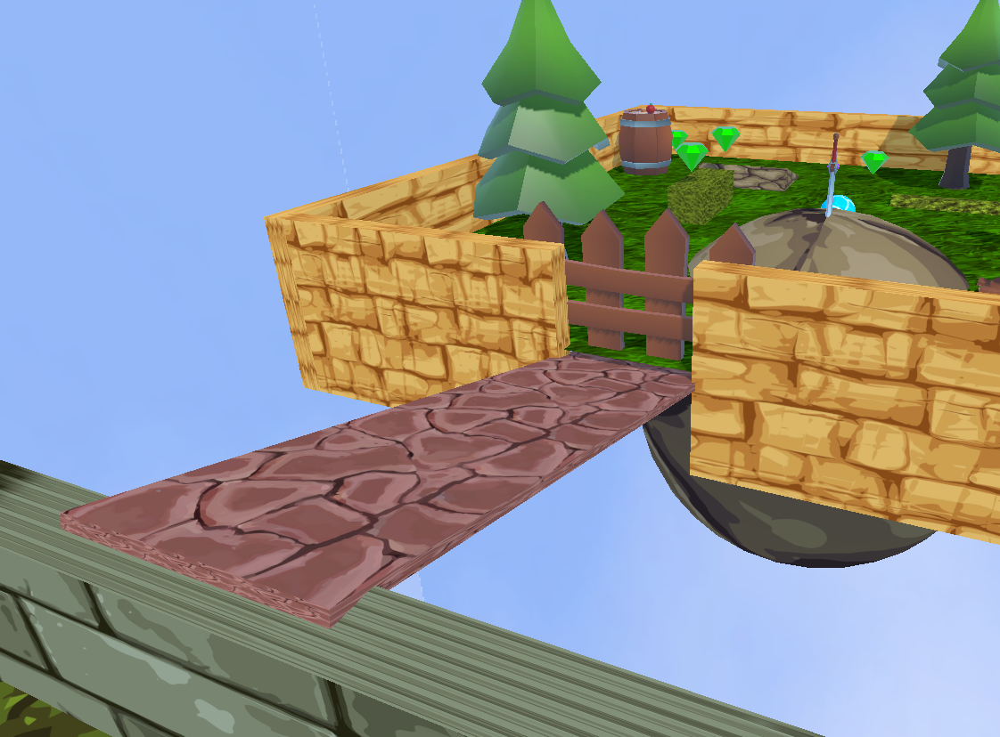
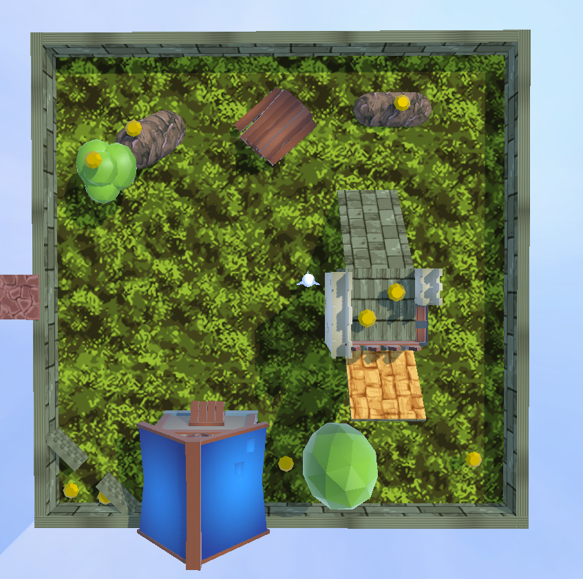
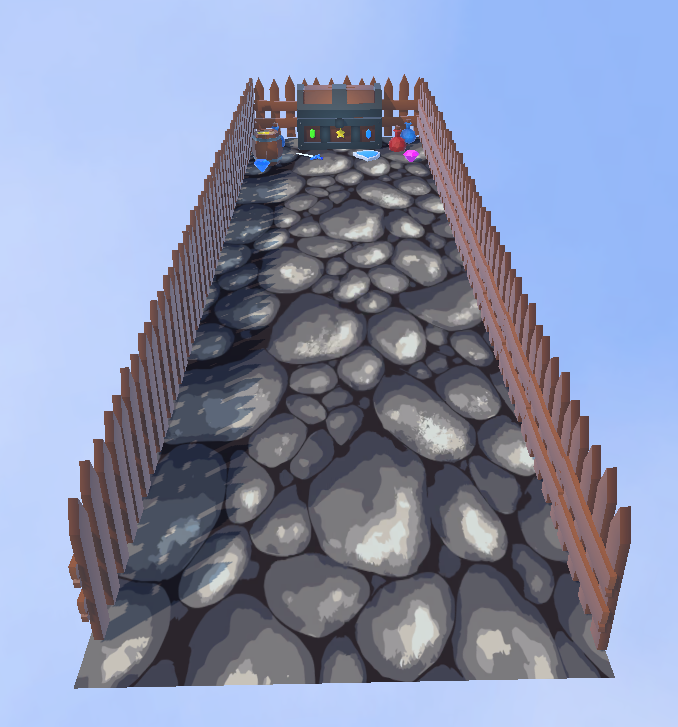
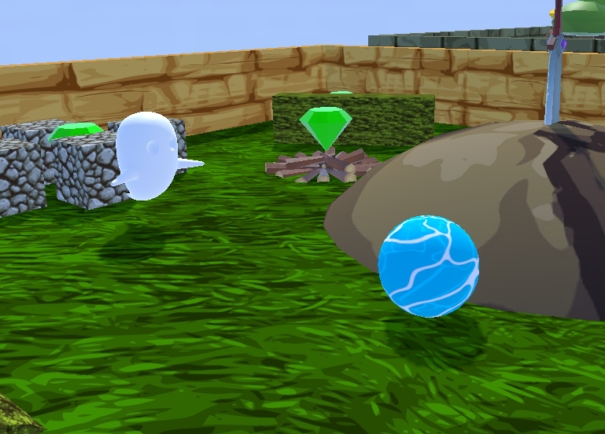
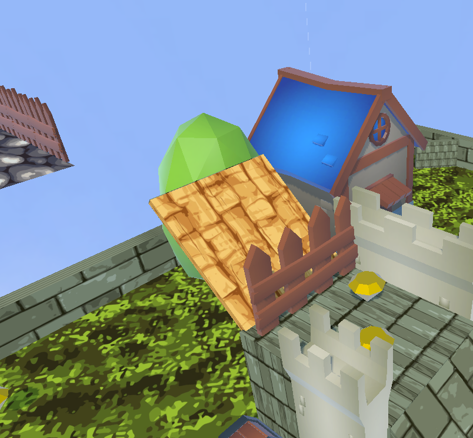
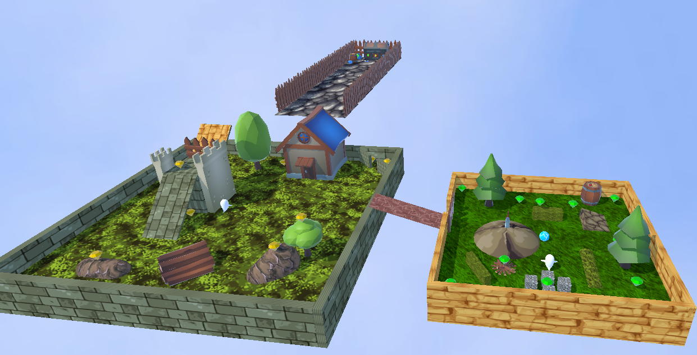

# Rollaball_Unity - Pedro Piñeiro Ordax 

Rollaball es un juego en Unity donde controlas una esfera que debe recolectar objetos (pickups) mientras evitas enemigos y obstáculos. El juego incluye una cámara en primera y tercera persona, un sistema de detección de colisiones y enemigos que persiguen al jugador.

## Características del Juego

- Movimiento fluido del jugador con teclado o giroscopio.
- Alternancia entre vista en primera y tercera persona.
- Enemigos que persiguen al jugador usando IA de navegación (NavMesh).
- Sistema de recolección de objetos.
- Transiciones de nivel basadas en pickups recolectados.
- Mensajes de victoria o derrota según el progreso.

## Capturas del Juego

### Nivel 1 
#### Objetivo: Recoger todos los pickups (10)

#### Al recogerlos se abre esa valla y pasa al estado de juego siguiente en el Level 2

### Nivel 2
#### Objetivo: Recoger todos los pickups (10)

### Final
#### Objetivo: Tocar el cofre

### Enemigo y Player

### Rampa Boost

### Juego Completo

## Scripts del Proyecto

### `PlayerController.cs`
Controla el movimiento del jugador y la interacción con el entorno:

- Mueve la esfera en base a la entrada del jugador (teclado o giroscopio).
- Alterna entre cámaras en primera y tercera persona con la tecla `F`.
- Gestiona la recolección de pickups y el avance de nivel.
- Detecta colisiones con enemigos y muestra mensajes de victoria o derrota.

### `CameraController.cs`
Controla la cámara en tercera persona:

- Mantiene una distancia fija respecto al jugador.
- Permite rotar la cámara alrededor del jugador con el ratón.
- Bloquea el cursor en el centro de la pantalla.

### `FirstPersonCamera.cs`
Maneja la cámara en primera persona:

- Sigue al jugador y permite la rotación con las teclas del teclado numérico (`Keypad 4`, `Keypad 6`, `Keypad 8`, `Keypad 2`).
- Proporciona una vista inmersiva del juego.

### `EnemyMovement.cs`
Define el comportamiento de los enemigos:

- Utiliza `NavMeshAgent` para que los enemigos sigan al jugador.
- Actualiza la posición objetivo del enemigo en cada frame para perseguir al jugador.

### `BoostRampa.cs`
Maneja una rampa de impulso:

- Si el jugador entra en contacto con la rampa (`OnTriggerEnter`), se le aplica una fuerza en una dirección específica.
- Usa `AddForce` en el `Rigidbody` del jugador con el modo `Impulse` para darle un salto repentino.

### `Rotator.cs`
Hace que los objetos giren constantemente:

- En cada `Update()`, rota el objeto 30 grados por segundo en el eje Y (`transform.Rotate(0, 30 * Time.deltaTime, 0)`).
- Se puede usar en pickups u otros elementos visuales.

## Controles

| Acción             | Tecla |
|-------------------|-------|
| Moverse          | `W, A, S, D` / `Flechas` |
| Cambiar cámara   | `F` |
| Rotar cámara (1ª persona) | `Keypad 4, 6, 8, 2` |

## Objetivo del Juego

1. Mueve la esfera para recolectar los pickups.
2. Evita los enemigos y obstáculos.
3. Avanza de nivel recogiendo una cantidad específica de pickups.
4. Llega a la meta para ganar el juego.